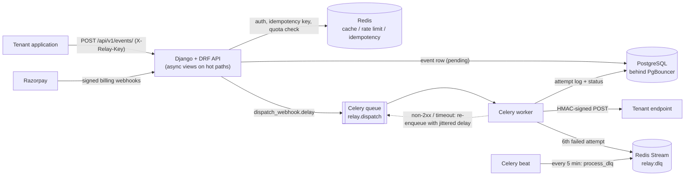

# Relay

Multi-tenant webhook delivery service. Tenants register HTTP endpoints, post events to a single API call, and Relay takes over delivery: signed requests, retries with jittered exponential backoff, per-endpoint rate limiting, idempotency, plan quotas, and a dead-letter queue for events that never get through.

## The problem

Sending a webhook is one HTTP POST. Doing it reliably is not: receivers time out, return 5xx, or go down for hours; producers retry blindly and double-send; one noisy tenant starves the others. Relay moves that whole concern out of the producing application. The producer's request returns as soon as the event is stored and queued (`202 Accepted`); everything after that is asynchronous and observable per attempt.

## Architecture



### Event lifecycle

1. `POST /api/v1/events/` authenticates the API key, rejects a repeated `idempotency_key` (24 h window, kept in Redis), rejects tenants over their monthly quota, writes the event as `pending`, enqueues `webhooks.dispatch_webhook`, and returns `202` with the event id.
2. The worker loads the event and checks the endpoint's per-minute rate limit (a Redis counter per endpoint and minute). Over the limit, the task is re-queued 60 seconds out rather than dropped.
3. The worker POSTs the JSON payload with `X-Relay-Event-ID`, `X-Relay-Event-Type`, `X-Relay-Timestamp` and `X-Relay-Signature` headers and a 30 s timeout. Every attempt is stored as a `DeliveryAttempt` (status code, duration, truncated response body or error).
4. A 2xx response marks the event `delivered` and counts it against the tenant's quota. Anything else schedules the next attempt after `uniform(0, min(2h, 30s * 2^(attempt-1)))` seconds (full jitter), up to 6 attempts in total.
5. After the sixth failure the event is marked `failed` and pushed onto the `relay:dlq` Redis Stream. A Celery beat job drains the stream every 5 minutes and marks those events `dead`.
6. A second beat job resets every tenant's delivery counter on the first of each month.

### Design notes

- **Fat serializers, thin views.** Validation, quota checks, cache invalidation and enqueueing live in serializers; views only call `is_valid()` and `save()`.
- **One Redis, four logical databases**: cache (0), Celery broker (1), rate limiting (2) and idempotency keys (3).
- **`acks_late` on the dispatch task**, so a worker that dies mid-delivery leaves the message to be redelivered instead of losing it.
- **Secrets are stored hashed.** API keys (`rly_live_...`) and signing secrets (`whsec_...`) are stored as SHA-256 digests and shown once. The request signature is `HMAC-SHA256` over `{timestamp}.{body}` keyed with the secret's SHA-256 hex digest, because the raw secret is not retained; receivers derive the same key by hashing their copy of the secret.
- **PgBouncer in transaction-pooling mode** sits between Django and Postgres, with `CONN_MAX_AGE = 0` as that mode requires.
- **Cache-aside** (`relay:cache:<resource>:<id>`) with explicit invalidation on writes, plus short TTLs on read-heavy resources.

## Features

- API-key authenticated multi-tenant API (`X-Relay-Key`), tenant registration and login, multiple keys per tenant
- Webhook endpoint CRUD with per-endpoint rate limits and soft delete
- Event ingestion with idempotency keys and `202` semantics
- Full per-attempt delivery history for every event (`/events/{id}/attempts/`)
- Plans with monthly delivery quotas: Free 1,000, Pro 50,000, Scale unlimited
- Razorpay subscriptions: create-subscription endpoint and a signature-verified webhook that activates, downgrades or cancels plans
- Next.js dashboard (endpoints, events with attempt history, API keys, usage, billing)

## Stack

| Layer | Technology |
|---|---|
| API | Django 5.1, Django REST Framework, adrf (async views) |
| Workers | Celery 5.4 (dispatch and maintenance queues), Celery beat |
| Data | PostgreSQL 16 via PgBouncer, Redis 7.2 (cache, rate limit, idempotency, Streams, broker) |
| Delivery | httpx, HMAC-SHA256 signing |
| Billing | Razorpay |
| Auth | API keys (SHA-256 at rest), Argon2 password hashing |
| Dashboard | Next.js 14, TypeScript, Tailwind CSS |
| Tests | pytest, factory-boy, fakeredis, respx |

## Run it

```bash
cp .env.example .env          # set POSTGRES_PASSWORD and the Razorpay test keys
docker compose up --build     # postgres, pgbouncer, redis, api (:8000), celery worker, celery beat
```

The compose file is a local stack: the API runs Django's development server and one worker consumes all three queues.

Register a tenant, create an endpoint, and send an event:

```bash
curl -X POST localhost:8000/api/v1/auth/register/ -H 'Content-Type: application/json' \
  -d '{"name":"Acme","email":"dev@acme.test","password":"change-me"}'        # response includes the API key

curl -X POST localhost:8000/api/v1/endpoints/ -H "X-Relay-Key: $KEY" -H 'Content-Type: application/json' \
  -d '{"url":"https://example.com/hooks","rate_limit_per_minute":60}'        # response includes the signing secret once

curl -X POST localhost:8000/api/v1/events/ -H "X-Relay-Key: $KEY" -H 'Content-Type: application/json' \
  -d '{"endpoint_id":"<id>","event_type":"order.created","payload":{"id":1},"idempotency_key":"order-1"}'
```

Dashboard:

```bash
cd frontend && cp .env.local.example .env.local && npm install && npm run dev
```

### Tests

```bash
pip install -r requirements/development.txt
pytest tests/unit tests/integration     # needs PostgreSQL reachable via the POSTGRES_* variables
./scripts/test_recursive.sh [--e2e]     # layered run; e2e needs the live Docker stack
```

Redis is faked in the suite (`fakeredis`) and receiver endpoints are mocked with `respx`, so no external services are called.

## API surface

| Method | Path | Purpose |
|---|---|---|
| POST | `/api/v1/auth/register/`, `/auth/login/` | Tenant signup and login |
| GET, POST | `/api/v1/api-keys/` | List and create API keys |
| DELETE | `/api/v1/api-keys/{id}/` | Revoke a key |
| GET | `/api/v1/usage/` | Plan, delivery count and quota |
| GET, POST | `/api/v1/endpoints/` | List and register webhook endpoints |
| GET, PATCH, DELETE | `/api/v1/endpoints/{id}/` | Inspect, update, deactivate |
| GET, POST | `/api/v1/events/` | List events; ingest an event (`202`) |
| GET | `/api/v1/events/{id}/` | Event status and payload |
| GET | `/api/v1/events/{id}/attempts/` | Per-attempt delivery history |
| POST | `/api/v1/billing/create-subscription/` | Start a Razorpay subscription |
| GET | `/api/v1/billing/subscription/` | Current subscription |
| POST | `/api/v1/billing/webhook/` | Razorpay events (signature-verified) |

More detail in [`code_docs/`](code_docs): API spec, models, architecture and Docker notes.

## Layout

```
apps/
  core/       API-key auth, cache-aside helpers, pagination, error shape
  tenants/    tenants, API keys, usage
  webhooks/   endpoints, events, delivery attempts, Celery dispatch + DLQ tasks
  billing/    Razorpay subscriptions and webhook handling
config/       settings (base / development / production), Celery app + beat schedule
frontend/     Next.js dashboard
tests/        unit, integration, e2e
```
